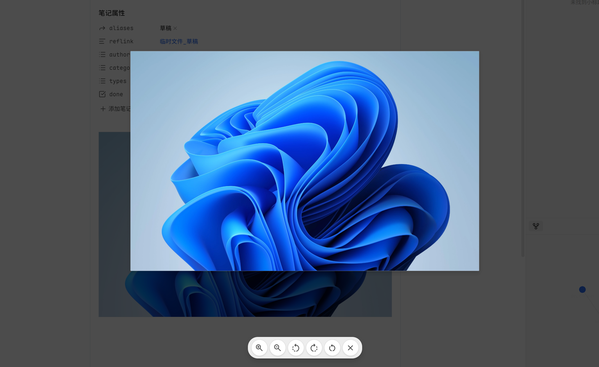

# Obsidian Only View Image

查看图片，仅此而已



## 功能特性

- **快捷触发** — Windows/Linux 默认 `Ctrl + 鼠标左键`，macOS 默认 `Cmd + 鼠标左键`，快捷键可自定义，支持无修饰键直接点击
- **智能缩放** — 可选初始缩放，图片按窗口比例自适应显示，滚轮或按钮可继续缩放
- **放大/缩小按钮** — 工具栏内置放大、缩小按钮，缩放步长可自定义
- **旋转操作** — 支持左旋/右旋 90°，一键重置视图
- **背景遮罩效果** — 三种遮罩模式可选：无遮罩、半透明遮罩、毛玻璃遮罩；支持亮色/暗色遮罩，不透明度和模糊强度可调
- **点击空白关闭** — 点击图片以外区域即可退出查看模式
- **拖拽移动** — 可选开启图片拖拽移动
- **工具栏开关** — 可选择是否显示底部工具栏
- **主题适配** — 自动适配 Obsidian 深色/浅色主题
- **Material Design** — 工具栏采用 Google Material Design 风格

## 使用方式

1. 在文档中找到想要查看的图片
2. 按住 `Ctrl`（macOS 为 `Cmd`）键，点击图片（也可设置为无修饰键直接点击）
3. 进入查看模式后：
   - **滚轮** — 缩放图片
   - **放大/缩小按钮** — 点击工具栏按钮缩放
   - **ESC** — 退出查看模式
   - **底部工具栏** — 放大、缩小、旋转、重置、关闭

## 插件设置

### 快捷键

| 设置项 | 默认值 | 说明 |
|--------|--------|------|
| 系统平台 | 自动检测 | 选择操作系统，决定修饰键选项 |
| 修饰键 | Win: Ctrl / Mac: Cmd | 触发查看模式的修饰键，可选"无"直接点击 |
| 鼠标按键 | 左键 | 触发查看模式的鼠标按键 |

### 显示

| 设置项 | 默认值 | 说明 |
|--------|--------|------|
| 初始缩放 | 开启 | 进入查看模式时是否自动缩放至窗口比例 |
| 初始显示比例 | 80% | 图片占窗口的百分比（仅初始缩放开启时可用） |
| 缩放步长 | 0.1 | 每次点击放大/缩小按钮或滚轮滚动的缩放增量 |
| 显示工具栏 | 开启 | 查看模式底部是否显示操作按钮 |

### 背景遮罩效果

| 设置项 | 默认值 | 说明 |
|--------|--------|------|
| 遮罩效果 | 半透明遮罩 | 可选：无遮罩、半透明遮罩、毛玻璃遮罩 |
| 遮罩颜色 | 暗色 | 可选：暗色、亮色（半透明和毛玻璃模式下可用） |
| 遮罩不透明度 | 0.7 | 遮罩层的明显程度（半透明和毛玻璃模式下可用） |
| 模糊强度 | 16px | 遮罩层的模糊程度（仅毛玻璃模式下可用） |

### 交互

| 设置项 | 默认值 | 说明 |
|--------|--------|------|
| 点击空白区域关闭 | 开启 | 点击图片以外区域关闭查看模式 |
| 允许拖拽移动 | 关闭 | 在查看模式下拖拽移动图片 |

## 安装

### 手动安装

1. 从 [Releases](https://github.com/lspzc/obsidian-only-view-image/releases) 下载最新版本
2. 将 `main.js`、`styles.css`、`manifest.json` 复制到你的 Vault 目录下：`VaultFolder/.obsidian/plugins/obsidian-only-view-image/`
3. 重启 Obsidian
4. 在 **设置 → 社区插件** 中启用本插件

### 从源码构建

```bash
git clone https://github.com/lspzc/obsidian-only-view-image.git
cd obsidian-only-view-image
npm install
npm run build
```

将生成的 `main.js`、`styles.css`、`manifest.json` 复制到插件目录即可。

## 开发

```bash
# 安装依赖
npm install

# 开发模式（监听文件变化自动重新编译）
npm run dev

# 生产构建
npm run build

# 代码检查
npm run lint
```

## 兼容性

- 最低 Obsidian 版本：1.0.0
- 支持桌面端和移动端

## 许可证

0-BSD
